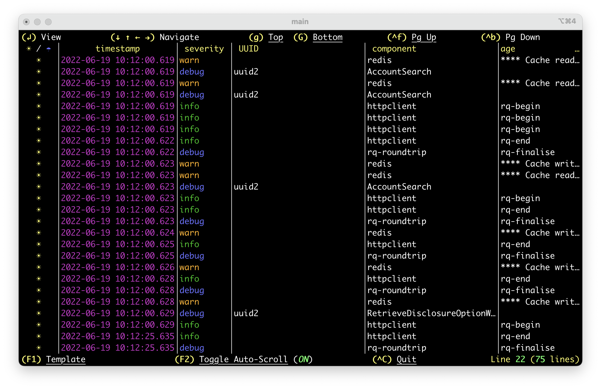
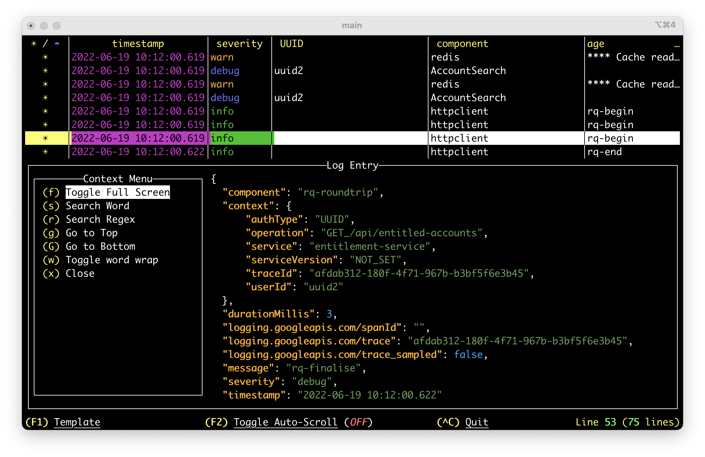
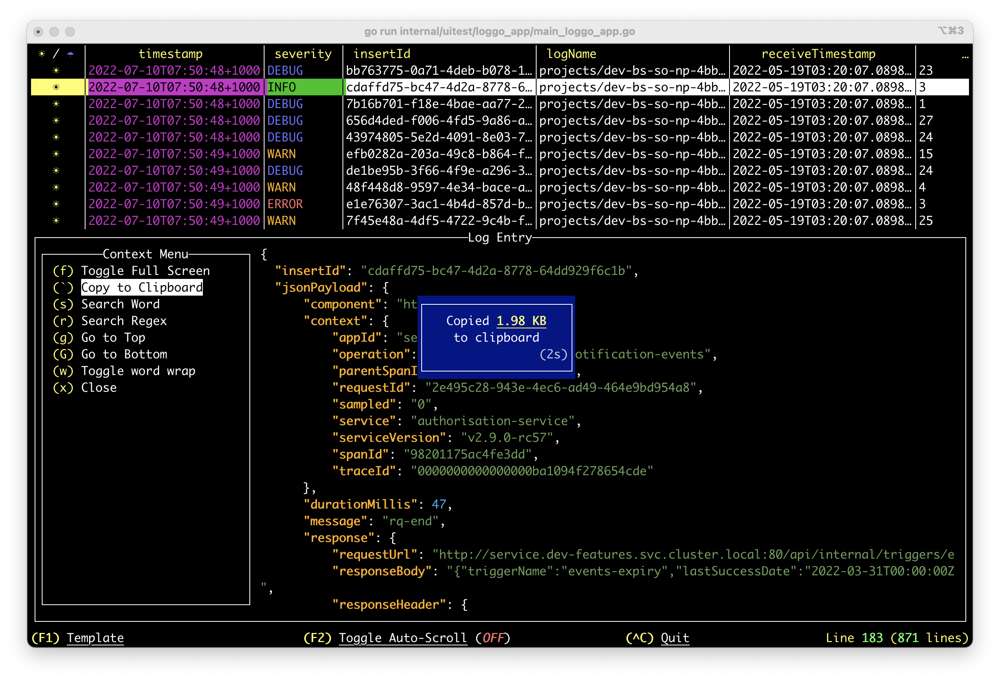
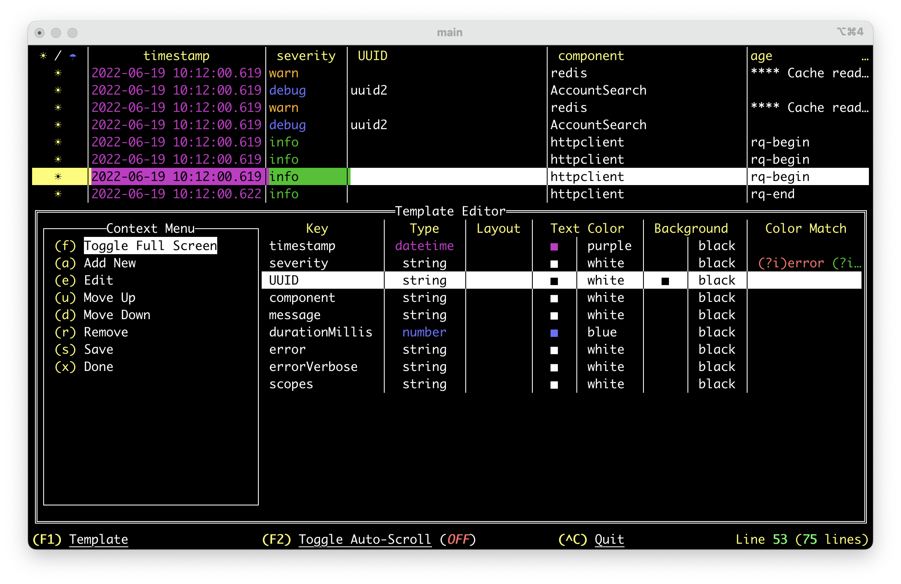
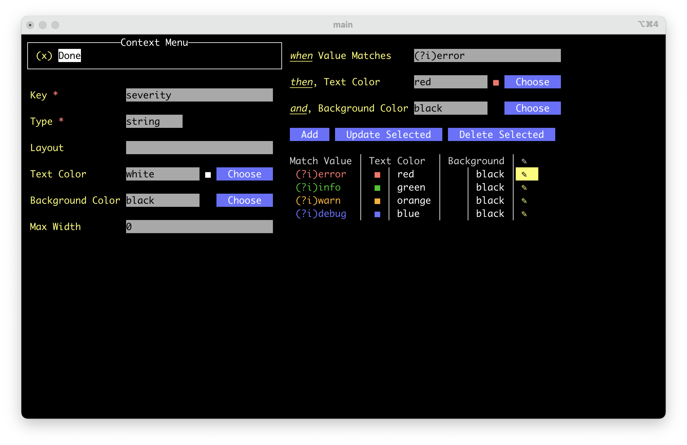

# l'oGGo: Rich Terminal User Interface Logging App

## Introduction

*For the impatient, go to [Getting Started](#getting-started)*
<p align="center">

</p>
l'oGGo or Log & Go is a rich Terminal User Interface app written in [golang](https://go.dev/) that harness the
power of your terminal to digest JSON based logs. This project is a hobby project
and is by no means bulletproof, but should be stable enough for every-day
troubleshooting workflows.

It came to light as JSON based logs and applications slowly drifted 
to become the de-facto standard for logging across applications and platforms. Although JSON data
structure provided a sound and well-behaved data model, the lack of local tools
to aid streaming & rendering for realtime troubleshooting such verbosely-rich 
produced payloads motivated me to embark in this endevour as I was, for a little
while, no longer able to quickly cast eyes on logs and pinpoint hotspots.


<table>
<tr>
<td>
<p>Without l`oGGo</p>

</td>
<td>
<p>With l`oGGo</p>

</td>
</tr>
</table>

Loggo App leveraged [tview](https://github.com/rivo/tview/) and [tcell](https://github.com/gdamore/tcell) projects for rich Terminal User 
Interface (TUI).

## Getting Started

### macOS/Linux with Homebrew/Linuxbrew:
The easiest way is to utilise [Homebrew](https://brew.sh/) **(macOS)** or [LinuxBrew](https://docs.brew.sh/Homebrew-on-Linux) **(Linux)**
package management system. Once installed simply issue the following command:

````
brew tap aurc/loggo
brew install aurc/loggo/loggo
````

### All Systems

### Install with Go
Assuming you have [go](https://go.dev/) installed in your system (best choice if not homebrew) and bin packages
are in your `PATH`, just run:

````
go install github.com/aurc/loggo@latest
````

### Build from Source:
Including **macOS**, build from source. 
Pre-Reqs:
- [Golang](https://go.dev/) v1.8+
- Checkout the project from [https://github.com/aurc/loggo/](https://github.com/aurc/loggo/)

````
go build -o loggo
````
> Install the `loggo` binary in your system's binary bucket or add `loggo` binary to your
path.

### Download Pre-Compiled binary

This option might be suitable for you if you don't have Home/Linux-Brew or golang 
readly available for you. In this case you can download a pre-compiled exectuable binary
for the following platforms:

Latest Release [pre-build binaries here](https://github.com/aurc/loggo/releases/latest)!

- Windows 11 plat (e.g. loggo_vx.y.z_linux_<plat>.tar.gz):
- Linux (both arm64 and amd64 plat):
  - ubuntu:  `tar.gz` file from releases (e.g. loggo_vx.y.z_linux_<plat>.tar.gz)
  - debian:  `*.deb` file from releases
  - redhat:  `*.rpm` file from releases
  - alpine:  `*.apk` file from releases

## Using l'oGGo

Loggo can be used to stream parsed logs from a persisted file and from a 
piped input and also provides a tool for creating log templates.

### `help` Command

To gain fine grained insight of each `loggo` command params, use
the `help` command, e.g.:
````
loggo help
loggo stream help
loggo template help
````

### `stream` Command



**From File:**
````
loggo stream --file <my file>
````
*With Template:*
````
loggo stream --file <my file> --template <my template yaml>
````

**From Pipe:**
````
tail -f <my file> | loggo stream
````
Kubernetes example:
````
kubectl logs -f -n <namespace> <pod> | loggo stream
````
*With Template:*
````
tail -f <my file> | loggo stream --template <my template yaml>
````

Note that you can pipe to anything that produces an output to the `stdin`.

**Some Additional Features:**
- Drill down onto each log entry

- Copy Log-Entry to Clipboard
  - Note: Linux requires X11 dev package. For instance, install `libx11-dev` or `xorg-dev` or `libX11-devel` to access X window system.
  
- Configure Rendering Templates:

- Fine Tune how columns are displayed (Template):
    - Note that single Value Matches are REGEX expressions.
  


### `template` Command
The template command opens up the template editor without the
need to stream logs. This is convenient if you want to craft
templates prior using the loggo command.

**Blank Canvas:**


````
loggo template
````

**Edit Existing Template:**
````
loggo template --file <my template yaml>
````


## Current Limitations

Most of the items listed here are slated for development in the near future,
prior the first release.
- Search log entry.
- Filter log by json key(s).
- Browse/Load new log templates on the fly.
- Create template with keys whose name contains `/` as it uses slashes to navigate to nested json branches.

## Feedback

Please let us know your **thoughts**, **feature requests** and **bug reports**! Use the issues report
link here: https://github.com/aurc/loggo/issues
