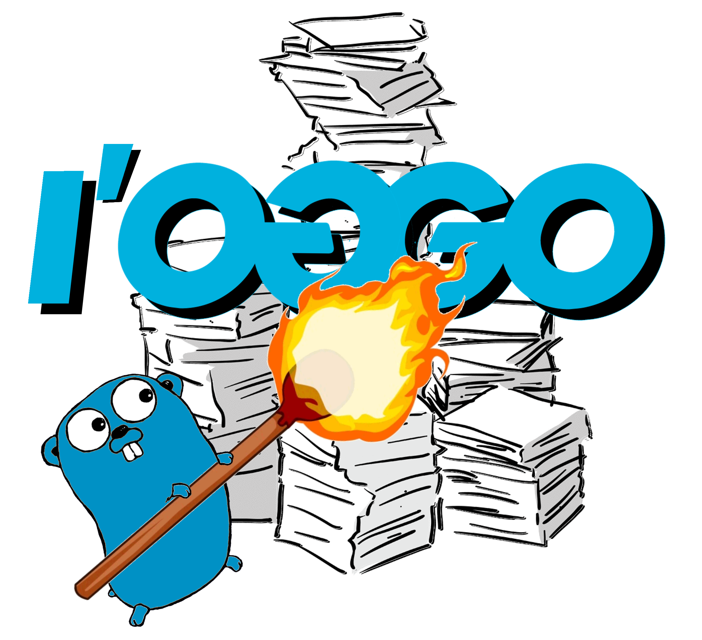

# l'oGGo: Rich Terminal User Interface Logging App

## Introduction

*For the impatient, go to [Getting Started](#Getting%20Startedd)*

l'oGGo or Log & Go is a rich Terminal User Interface app written in [golang]() that harness the
power of your terminal to digest JSON based logs. This project is a hobby project
and is by no means bulletproof, but should be stable enough for every-day
troubleshooting workflows.

It came to light as many cloud providers started supporting rich JSON based
logs and applications slowly drifted to such pattern. Although JSON data
structure provided a sound and well-behaved data model, the lack of local tools
to aid streaming & rendering for realtime troubleshooting such verbosely-rich 
produced payloads motivated me to embark in this endevour as I was, for a little
while, no longer able to quickly cast eyes on logs and pinpoint hotspots.

Loggo App leveraged [tview]() and [tcell]() projects for rich Terminal User 
Interface (TUI).

## Getting Started

### macOS Systems:
The easiest way is to utilise [Homebrew]() package management system. Once 
installed simply issue the following command:

````
brew install loggo
````

### Build fron Source:
Including **macOS**, build from source. 
Pre-Reqs:
- [Golang]() v1.8+
