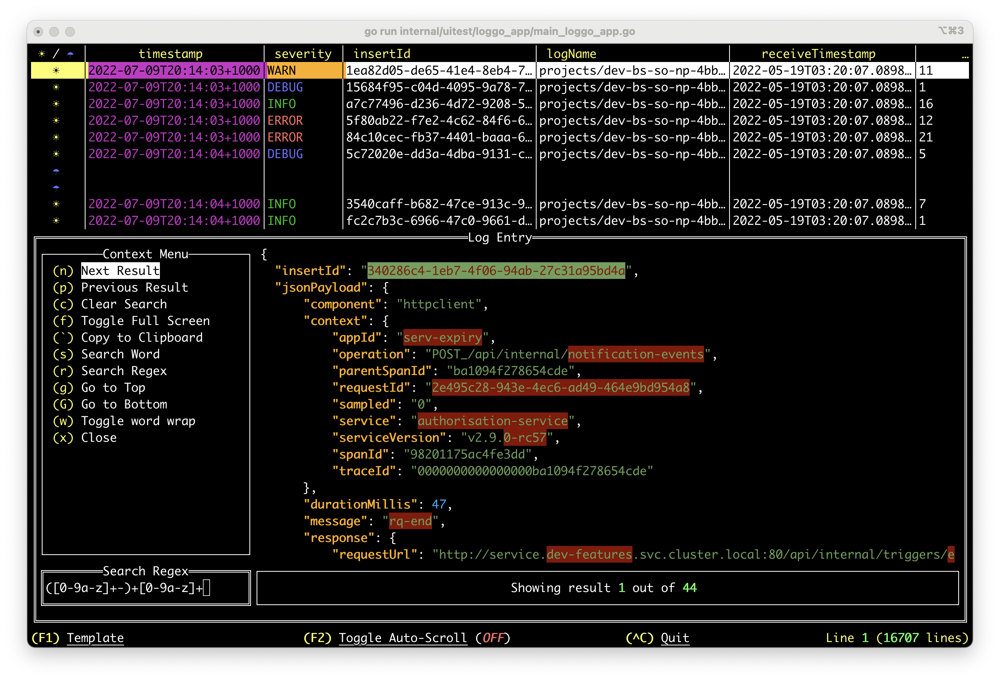
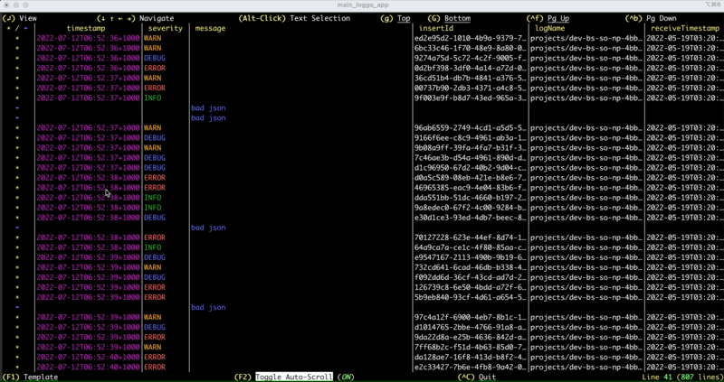

# l'oGGo: Rich Terminal User Interface Logging App

## Introduction

*For the impatient, go to [Getting Started](#getting-started)*
<p align="center">

</p>

l'oGGo or Log & Go is a rich Terminal User Interface app written in [golang](https://go.dev/) that harness the
power of your terminal to digest log streams based on JSON based logs.

This can be used against applications running locally, on a Kubernetes cluster (see [K8S Cheatsheet](#k8s)), GCP
Stack Driver ([Google Logs](https://cloud.google.com/logging), see [GCP-Stream Command](#gcp-stream-command)) and many others.


<table>
<tr>
<td>
<p>Without l`oGGo</p>

</td>
<td>
<p>With l`oGGo</p>

</td>
</tr>
</table>

Loggo App leveraged [tview](https://github.com/rivo/tview/) and [tcell](https://github.com/gdamore/tcell) projects for rich Terminal User 
Interface (TUI).

## Getting Started

### macOS/Linux with Homebrew/Linuxbrew:
The easiest way is to utilise [Homebrew](https://brew.sh/) **(macOS)** or [LinuxBrew](https://docs.brew.sh/Homebrew-on-Linux) **(Linux)**
package management system. Once installed simply issue the following command:

````
brew tap aurc/loggo
brew install aurc/loggo/loggo
````

### All Systems

### Install with Go
Assuming you have [go](https://go.dev/) installed in your system (best choice if not homebrew) and bin packages
are in your `PATH`, just run:

````
go install github.com/aurc/loggo@latest
````

### Build from Source:
Including **macOS**, build from source. 
Pre-Reqs:
- [Golang](https://go.dev/) v1.8+
- Checkout the project from [https://github.com/aurc/loggo/](https://github.com/aurc/loggo/)

````
go build -o loggo
````
> Install the `loggo` binary in your system's binary bucket or add `loggo` binary to your
path.

### Download Pre-Compiled binary

This option might be suitable for you if you don't have Home/Linux-Brew or golang 
readly available for you. In this case you can download a pre-compiled exectuable binary
for the following platforms:

Latest Release [pre-build binaries here](https://github.com/aurc/loggo/releases/latest)!

- Windows 11 plat (e.g. loggo_vx.y.z_linux_<plat>.tar.gz):
- Linux (both arm64 and amd64 plat):
  - ubuntu:  `tar.gz` file from releases (e.g. loggo_vx.y.z_linux_<plat>.tar.gz)
  - debian:  `*.deb` file from releases
  - redhat:  `*.rpm` file from releases
  - alpine:  `*.apk` file from releases

## Using l'oGGo

Loggo can be used to stream parsed logs from a persisted file and from a 
piped input and also provides a tool for creating log templates.

### `help` Command

To gain fine grained insight of each `loggo` command params, use
the `help` command, e.g.:
````
loggo help
loggo help stream
loggo help template
loggo help gcp-stream
````

### `stream` Command


**From File:**
````
loggo stream --file <my file>
````
*With Template:*
````
loggo stream --file <my file> --template <my template yaml>
````

**From Pipe:**
````
tail -f <my file> | loggo stream
````
Kubernetes example (See [K8S Cheatsheet](#k8s-cheatsheet))
````
kubectl logs -f -n <namespace> <pod> | loggo stream
````
*With Template:*
````
tail -f <my file> | loggo stream --template <my template yaml>
````

Note that you can pipe to anything that produces an output to the `stdin`.

**Some Additional Features:**
- Drill down onto each log entry

- Copy Log-Entry to Clipboard
  - Note: Linux requires X11 dev package. For instance, install `libx11-dev` or `xorg-dev` or `libX11-devel` to access X window system.
  
- Navigate Left-Right-Up-Down on Large Grids
  - Select a Line
  - Use the arrow keys (`↓ ↑ ← →`)
    
- Select on screen text
  - Horizontally based selection (`Alt` + Mouse `Click/Drag`)
  - Block/Vertical based selection (`Cmd`+`Opt`+ Mouse `Click/Drag` - macOS)
  - Copy the selected text to clipboard (`Cmd`+`C` - macOS/`Ctrl`+`C` - other systems)
     
- Configure Rendering Templates:

- Fine Tune how columns are displayed (Template):
    - Note that single Value Matches are REGEX expressions.
  

### `gcp-stream` Command 
l`oGGo natively supports GCP Logging but in order to use this feature, there are a few caveats:
- You have [gcloud command line SDK](https://cloud.google.com/sdk/docs/install) installed locally.
- Your account has the required permissions to access the logging resources.


Note: `gcp-stream` **does not** support piped commands. If you want to use piped
commands (e.g. chaining K8S output) use the `stream` command instead.

Example:
````
loggo gcp-stream \
    --filter 'resource.labels.namespace_name="some-namespace" resource.labels.container_name="some-container"' \
    --project some-project-ID \
    --from 10m
````
Where:
````
Usage:
  loggo gcp-stream [flags]

Flags:
  -f, --filter string        Standard GCP filters
  -d, --from string          Start streaming from:
                               Relative: Use format "1s", "1m", "1h" or "1d", where:
                                         digit followed by s, m, h, d as second, minute, hour, day.
                               Fixed:    Use date format as "yyyy-MM-ddH24:mm:ss", e.g. 2022-07-30T15:00:00
                               Now:      Use "tail" to start from now (default "tail")
  -h, --help                 help for gcp-stream
      --params-list          List saved gcp connection/filtering parameters for convenient reuse.
      --params-load string   Load the parameters for reuse. If any additional parameters are
                             provided, it overrides the loaded parameter with the one explicitly provided.
      --params-save string   Save the following parameters (if provided) for reuse:
                               Project:   The GCP Project ID
                               Template:  The rendering template to be applied.
                               From:      When to start streaming from.
                               Filter:    The GCP specific filter parameters.
  -p, --project string       GCP Project ID (required)
  -t, --template string      Rendering Template
````

For convenience, you can build a list of frequently used command parameters/flags and reuse them without
having to rewrite lengthy list of parameters, for example:

````
loggo gcp-stream \
    --filter 'resource.labels.namespace_name="some-namespace" resource.labels.container_name="some-container"' \
    --project some-project-ID \
    --from 10m
    --template /tmp/myTemplate.yaml
    --params-save mySavedParams1
````

Then you simply issue:
````
loggo gcp-stream --params-load mySavedParams1
````

If you want to review all saved params buckets, issue the following command:

````
loggo gcp-stream --params-list
````

Additionally, you might want to overwrite some parameters. The example command uses `--from 10m`, and
say you want to `tail` instead:

````
loggo gcp-stream --params-load mySavedParams1 --from tail
````

Any additional parameter provided will overwrite the loaded params at runtime.

### `template` Command
The template command opens up the template editor without the
need to stream logs. This is convenient if you want to craft
templates prior using the loggo command.

**Blank Canvas:**


````
loggo template
````

**Edit Existing Template:**
````
loggo template --file <my template yaml>
````

## K8S Cheatsheet

Combined logs of all pods of an application.
````
kubectl -n <some-namespace> logs -f deployment/<application-name> \
  --all-containers=true \
  --since=10m | loggo stream
````

Logs of a pod.
````
kubectl logs -f -n <some-namespace> <pod-name> | loggo stream
````

## Current Limitations

Most of the items listed here are slated for development in the near future,
prior the first release.
- Search log entry.
- Filter log by json key(s).
- Browse/Load new log templates on the fly.
- Create template with keys whose name contains `/` as it uses slashes to navigate to nested json branches.

## Feedback

Please let us know your **thoughts**, **feature requests** and **bug reports**! Use the issues report
link here: https://github.com/aurc/loggo/issues
